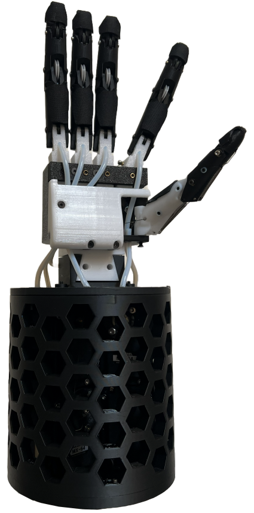

# RoboticHand
 This open-source robotic hand was designed and developed as part of a masters thesis in manufacturing technology at Aalborg University, 2026.



## Grasping Images


## Setup
    In order to set up the hand for use, you first must identify the Dynamixel Motor IDs that correspond to each degree of actuation. These must be entered into motor_config.py, into the "DEFAULT_CONFIG" field.

    Then ensure that the motors have been connected to the PCB connector for motor power input and that the USB is connected to your machine.

    Then turn on power from a standard lab power supply set at 12V and 10A, and make sure that the motors show a light indicating that they are turning on.

    All digits should be set to their most "open" configuration before initializing main.py. If a calibration.json file already exists in the repository, then the calibration routine will not be executed. To recalibrate, remove the calibration.json file and run:

   ```bash
   python main.py
   ```
    
    When the calibration is finished, the motion editor UI window will open.

## How to use
    If the setup steps above have already been performed, simply run the following command to open the motion editor UI:

   ```bash
   python main.py
   ```


## Dependencies
The code in this repository depends on the following packages:

\
\
\


## Contributors
This repository and the robotic hand was designed and developed by Anders Bloch Lauridsen, Emil Faldt Jakobsen and Peter Plass Jensen in their Masters Thesis at Aalborg University.

<section id="sec_contributors">
<table>
  <tr> 
    <td align="center"><a target="_blank" rel="noreferrer noopener" href="https://github.com/EmilFaldt"><br/><sub><b>Emil Faldt</b></sub></a></br><a href="https://github.com/EmilFaldt" title=""></a></td>
    <td align="center"><a target="_blank" rel="noreferrer noopener" href="https://github.com/andersbloch09"><br/><sub><b>Anders Bloch Lauridsen</b></sub></a></br><a href="https://github.com/andersbloch09" title=""></a></td>
    <td align="center"><a target="_blank" rel="noreferrer noopener" href="https://github.com/Djauvel"><br/><sub><b>Peter Plass Jensen</b></sub></a></br><a href="https://github.com/Djauvel" title=""></a></td>
  </tr>
</table>
